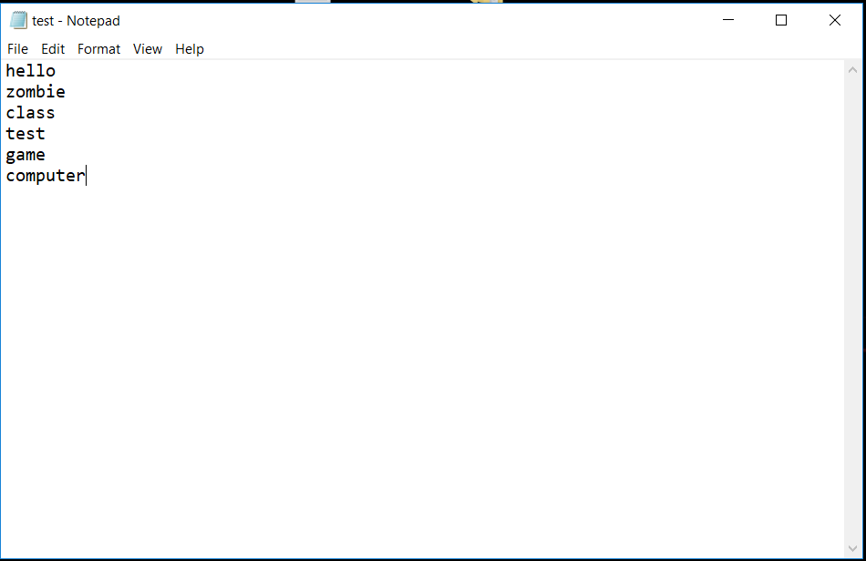

# Hangman Game in Clojure
Hangman Game Using Clojure Programming Language

# <h1> Sample Text File
You can any number of words but needs to be in the next line

  
# <h1> Output
The Game lets the user play the game until he types Exit. It keeps generating a random word from the given text file and depending on the users guesses it create a new function to keep track of wins or loss.
He can try a new word by typing New.
  
# <h4> This sample output is for Correct Guess

# <h4> This Output if for Wrong Guess

